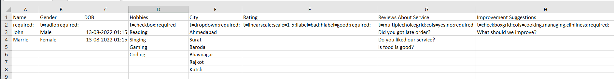

# excel-to-google-form

> This is web app to convert excel file to google form

## Steps to Convert Excel to Google form

- Step 1:
    - Add Headings to first row of the excel file
- Setp 2:
    - Add following parameters as and when required or else keep it empty
        - **required**: field required in form
        - **t** : type of the input field for form
        - **shuffle**: To shuffle radio and checkbox options
        - **scale**: scale when type is linear scale
        - **hlabel**: hight label when type is linear scale
        - **llable**: low label when type is linear scale 
        - **cols**: columns when datatype is multiple choice group or chcekbox grid
        - **(Note: You must seperate this parameters by ; and ends with ; )**
- Step 3:
    - You must add atleast one entry in order to detect data type if not mentioned in second row
- Step 4:
    - Visit website and click convert excel to form button
- Step 5:
    - Drag and drop excel file and click to get file data button
- Step 6:  
    - Read Form input fields details
- Step 7:
    - Enter Following Details
        - Document Title: form name shown in google form website
        - Form Title: Form title which is shown in as title in form
        - Form Description: form description is shown after form title in form
- Step 8:
    - Click on Add Fields to Form button
- Step 9:
    - Click on see form button to see google form
- Step 10:
    - Ta da Your have Successfully Created Google from from Excel file 

## Excel file details for different types of inputs

- Text, Number, Date :
    - it will automatic detected from entries that you entered
- Radio:
    - You need to add t=radio to second row
    - Add radio options to following column after second row
    - You can add shuffle to shuffle options
- Checkbox:
    - You need to add t=checkbox to second row
    - Add checkbox options to following column after second row
    - You can add shuffle to shuffle options
- DropDown:
    - You need to add t=dropdown in second row
    - Add dropdown options to following column after second row
    - You can add shuffle to shuffle options
- Linear scale:
    - You need to add t=linearscale to second row
    - Add scale=low-high value to second row
    - Add llabel for low label to second row
    - Add hlabel for high label to second row
- Multiple Choice Grid:
    - You need to add t=multiplechoicegrid to second row
    - Add cols=columns values seperated by , to second row
    - Add questions in column after second row
- Checkbox Grid:
    - You need to add t=checkboxgrid to second row
    - Add cols=columns values seperated by , to second row
    - Add questions in column after second row
  
## Sample Excel File    
> This is sample excel file to create google form to get customer details of hotel

